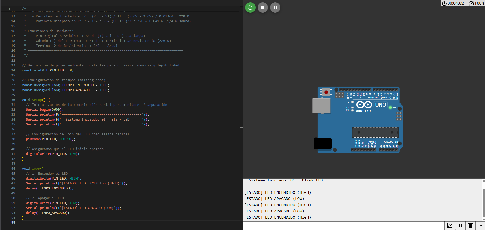
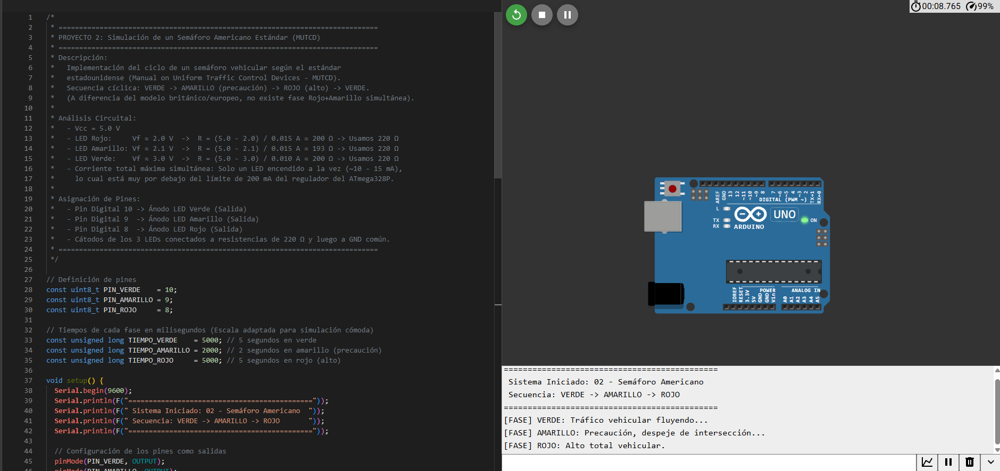
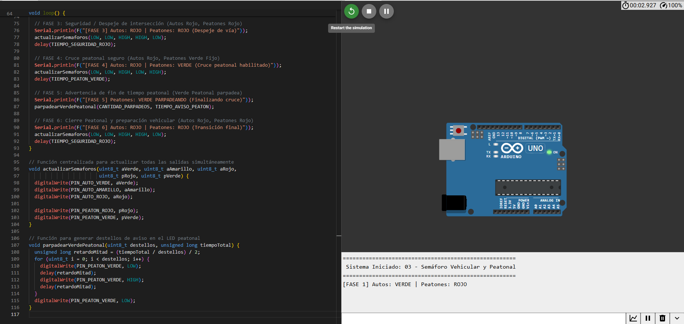
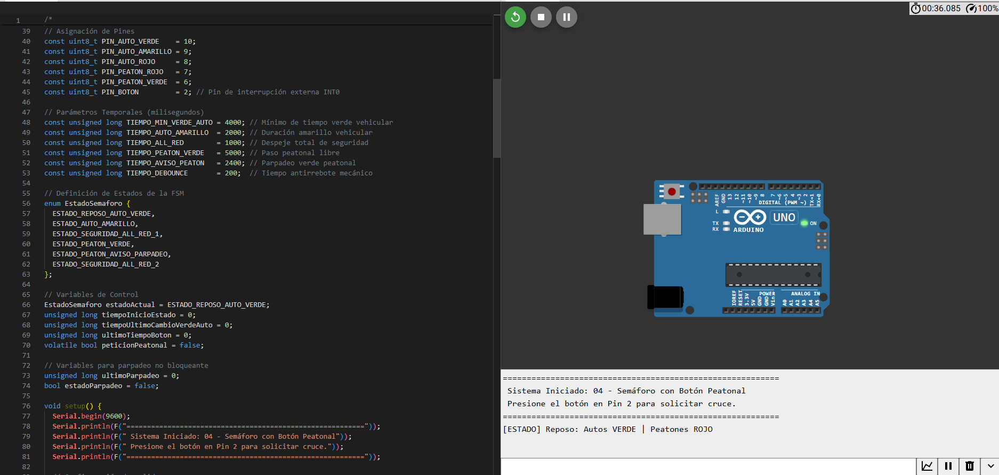

# INFORME DE LABORATORIO: ANÁLISIS, DISEÑO Y SIMULACIÓN DE SISTEMAS SEMAFÓRICOS

**Institución:** Universidad Nacional de San Antonio Abad del Cusco (UNSAAC)  
**Facultad:** Facultad de Ingeniería Eléctrica, Electrónica, Informática y Mecánica  
**Curso:** Robótica / Sistemas Embebidos  
**Estudiante:** Edmil Jampier Saire Bustamante  
**Código:** 174449  
**Correo Institucional:** [174449@unsaac.edu.pe](mailto:174449@unsaac.edu.pe)  
**Fecha:** 5 de Octubre de 2026  
**Repositorio GitHub:** [https://github.com/milith0kun/robotica-semaforos](https://github.com/milith0kun/robotica-semaforos)  
**Documento LaTeX / PDF:** Disponible en la carpeta [`informe_latex/`](informe_latex/) ([`main.tex`](informe_latex/main.tex) y [`main.pdf`](informe_latex/main.pdf))

---

## RESUMEN
En este informe se presenta el análisis teórico, diseño circuital, diagramas de conexión eléctrica, codificación en C++/Arduino y validación de cuatro sistemas de control secuencial implementados en el simulador Wokwi:
1. **Control de encendido y apagado de un LED (Blink).**
2. **Semáforo vehicular estándar americano (MUTCD).**
3. **Semáforo para tránsito vehicular y peatonal sincronizado.**
4. **Semáforo inteligente a demanda mediante pulsador peatonal y Máquina de Estados Finitos (FSM) no bloqueante.**

---

## 1. FUNDAMENTO TEÓRICO Y CÁLCULOS CIRCUITALES

### 1.1 Modelo del Diodo Emisor de Luz (LED) y Ley de Ohm
Un diodo LED emite luz cuando se polariza en sentido directo. Debido a que su resistencia interna en conducción directa es baja, se requiere una resistencia limitadora de corriente ($R$) en serie:

$$V_{CC} - V_R - V_f = 0 \implies V_R = V_{CC} - V_f$$

Por **Ley de Ohm**:
$$R = \frac{V_{CC} - V_f}{I_f}$$

Para $V_{CC} = 5.0\text{ V}$ (Arduino UNO), un LED rojo con $V_f \approx 2.0\text{ V}$ y corriente de diseño $I_f = 13.6\text{ mA}$:
$$R = \frac{5.0\text{ V} - 2.0\text{ V}}{0.0136\text{ A}} \approx 220\ \Omega$$

### 1.2 Disipación de Potencia
$$P_R = I_f^2 \cdot R = (0.0136\text{ A})^2 \cdot 220\ \Omega \approx 40.7\text{ mW}$$
Con resistores comerciales de $1/4\text{ W}$ ($250\text{ mW}$), la carga térmica opera con un factor de seguridad superior al $600\%$.

---

## 2. DESARROLLO Y RESULTADOS DE LAS SIMULACIONES

---

### CIRCUITO 1: Prender y Apagar un LED (Blink)

* **Objetivo:** Conmutación periódica en pin digital `D8` a $0.5\text{ Hz}$ ($1000\text{ ms}$ ON, $1000\text{ ms}$ OFF).
* **Conexión:** Pin D8 $\to$ Ánodo LED $\to$ Cátodo $\to$ Resistor $220\ \Omega$ $\to$ GND.

#### Captura de la Simulación en Wokwi

---

### CIRCUITO 2: Semáforo Americano (MUTCD)

* **Objetivo:** Ciclo vehicular estándar estadounidense (MUTCD): **Verde (5s) $\to$ Amarillo (2s) $\to$ Rojo (5s) $\to$ Verde**.
* **Pines:** D10 (Verde), D9 (Amarillo), D8 (Rojo) con resistencias de $220\ \Omega$ a GND.

| Fase | D10 (Verde) | D9 (Amarillo) | D8 (Rojo) | Duración |
|:---:|:---:|:---:|:---:|:---:|
| **1. Tránsito Libre** | **HIGH** | LOW | LOW | 5.0 s |
| **2. Advertencia** | LOW | **HIGH** | LOW | 2.0 s |
| **3. Alto Total** | LOW | LOW | **HIGH** | 5.0 s |

#### Captura de la Simulación en Wokwi

---

### CIRCUITO 3: Semáforo para Carros y Personas Sincronizado

* **Objetivo:** Seguridad vial con exclusión mutua, intervalo *All-Red* de $1\text{ s}$ para despeje y parpadeo de advertencia en el verde peatonal.
* **Pines:** Vehicular (D10 Verde, D9 Amarillo, D8 Rojo) y Peatonal (D7 Rojo, D6 Verde).

| Fase | Autos (V / A / R) | Peatones (R / V) | Duración | Función |
|:---:|:---:|:---:|:---:|:---|
| **1** | **ON** / off / off | **ON** / off | 5.0 s | Flujo vehicular |
| **2** | off / **ON** / off | **ON** / off | 2.0 s | Frenado de autos |
| **3** | off / off / **ON** | **ON** / off | 1.0 s | *All-Red:* Despeje de vía |
| **4** | off / off / **ON** | off / **ON** | 4.0 s | Cruce peatonal seguro |
| **5** | off / off / **ON** | off / **Blink** | 2.0 s | Fin de cruce peatonal |
| **6** | off / off / **ON** | **ON** / off | 1.0 s | Transición a verde vehicular |

#### Captura de la Simulación en Wokwi

---

### CIRCUITO 4: Semáforo Inteligente con Botón Peatonal (FSM No Bloqueante)

* **Objetivo:** Automatización a demanda con pulsador en pin `D2` (`INPUT_PULLUP`).
* **FSM no bloqueante:** Temporización con `millis()` para respuesta en tiempo real.
* **Antirrebote:** Ventana de $200\text{ ms}$.
* **Tiempo vehicular garantizado:** $4\text{ s}$ mínimos de verde vehicular.

#### Captura de la Simulación en Wokwi

---

## 3. COMPARATIVA DE RESULTADOS

| Proyecto | Salidas | Entradas | Técnica de Control | Consumo Máximo |
|:---|:---:|:---:|:---|:---:|
| **01. Blink LED** | 1 LED | 0 | Conmutación Cíclica | 13.6 mA |
| **02. Semáforo Americano** | 3 LEDs | 0 | Secuencia 3 Fases MUTCD | 13.6 mA |
| **03. Vehicular + Peatonal** | 5 LEDs | 0 | Interbloqueo 6 Fases con *All-Red* | 27.2 mA |
| **04. Botón a Demanda** | 5 LEDs | 1 Botón | FSM No Bloqueante con `millis()` | 27.2 mA |

---

## 4. CONCLUSIONES
1. **Protección Circuital:** El dimensionamiento de resistencias a $220\ \Omega$ garantiza un funcionamiento seguro por debajo del umbral de $40\text{ mA}$ del microcontrolador.
2. **Seguridad Vial:** La inclusión de ventanas *All-Red* y destellos preventivos cumple con estándares de ingeniería de tráfico.
3. **Eficiencia de FSM No Bloqueante:** El uso de `millis()` y `INPUT_PULLUP` permite atender eventos asíncronos sin retrasos bloqueantes.
4. **Disponibilidad en LaTeX y PDF:** El informe completo en formato académico LaTeX se encuentra compilado en [`informe_latex/main.pdf`](informe_latex/main.pdf).

---

## 5. ENLACES Y TRAZABILIDAD
* **Repositorio GitHub:** [https://github.com/milith0kun/robotica-semaforos](https://github.com/milith0kun/robotica-semaforos)
* **ID de Sesión:** `231cda85-c992-4f6b-8f80-94698b1b354a`
