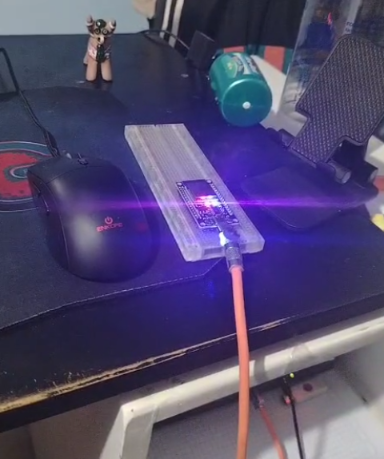

# Laboratorio de Robótica: Análisis, Diseño y Simulación de Circuitos Semafóricos

**Estudiante:** Edmil Jampier Saire Bustamante  
**Código:** 174449  
**Universidad:** Universidad Nacional de San Antonio Abad del Cusco (UNSAAC)  
**Repositorio GitHub:** [https://github.com/milith0kun/robotica-semaforos](https://github.com/milith0kun/robotica-semaforos)  

---

## 📸 Montaje Experimental Físico


---

## 📁 Estructura del Repositorio

```text
Robotica/
├── 01_Blink_LED/                      # Circuito 1: Prender y apagar un LED
│   ├── 01_Blink_LED.ino               # Código fuente Arduino comentado
│   ├── diagram.json                   # Esquema de conexión para Wokwi
│   ├── wokwi-project.txt              # Configuración de Wokwi
│   └── README.md                      # Explicación y cálculos
├── 02_Semaforo_Americano/             # Circuito 2: Semáforo vehicular americano (MUTCD)
│   ├── 02_Semaforo_Americano.ino      # Código fuente con secuencia Verde->Amarillo->Rojo
│   ├── diagram.json                   # Esquema de conexión para Wokwi
│   ├── wokwi-project.txt              # Configuración de Wokwi
│   └── README.md                      # Explicación y tabla de estados
├── 03_Semaforo_Vehicular_Peatonal/    # Circuito 3: Semáforo sincronizado autos + peatones
│   ├── 03_Semaforo_Vehicular_Peatonal.ino # Código fuente con interbloqueo seguro
│   ├── diagram.json                   # Esquema con 5 LEDs y resistencias
│   ├── wokwi-project.txt              # Configuración de Wokwi
│   └── README.md                      # Matriz de estados y seguridad
├── 04_Semaforo_Boton_Peatonal/        # Circuito 4: Semáforo a demanda con botón peatonal
│   ├── 04_Semaforo_Boton_Peatonal.ino # FSM no bloqueante con millis() y debouncing
│   ├── diagram.json                   # Esquema con pulsador e INPUT_PULLUP
│   ├── wokwi-project.txt              # Configuración de Wokwi
│   └── README.md                      # Diagrama de estados FSM
├── docs/
│   ├── analisis_y_diseno.md           # Memoria técnica completa de ingeniería
│   └── img/
│       └── captura_real_laboratorio.png # Fotografía real del montaje en laboratorio
├── INFORME_LABORATORIO.md             # Informe completo de laboratorio
├── .gitignore                         # Filtro de archivos no deseados
└── README.md                          # Este archivo principal
```

---

## 🔬 Resumen de los Circuitos

1. **01. Blink LED:** Control binario periódico con cálculo de resistencia de $220\ \Omega$ por Ley de Ohm.
2. **02. Semáforo Americano:** Ciclo vehicular MUTCD estándar (Verde 5s $\to$ Amarillo 2s $\to$ Rojo 5s).
3. **03. Vehicular y Peatonal Sincronizado:** 5 canales digitales, intervalo de seguridad *All-Red* de 1s y parpadeo de advertencia en el verde peatonal.
4. **04. Semáforo a Demanda con Botón Peatonal:** Máquina de Estados Finitos (FSM) no bloqueante con `millis()`, pin `D2` con `INPUT_PULLUP` y filtro antirrebote de 200 ms.

---

## 🌐 Simulación en Wokwi
1. Entra a [Wokwi Arduino Uno Simulator](https://wokwi.com/projects/new/arduino-uno).
2. Pega el archivo `.ino` y en la pestaña `diagram.json` pega el JSON correspondiente.
3. Haz clic en **Start the simulation**.

---

## 🔗 Trazabilidad
- **ID de Sesión de Desarrollo:** `231cda85-c992-4f6b-8f80-94698b1b354a`
- **Informe de Laboratorio:** Consulte [`INFORME_LABORATORIO.md`](INFORME_LABORATORIO.md) para la memoria descriptiva completa.
